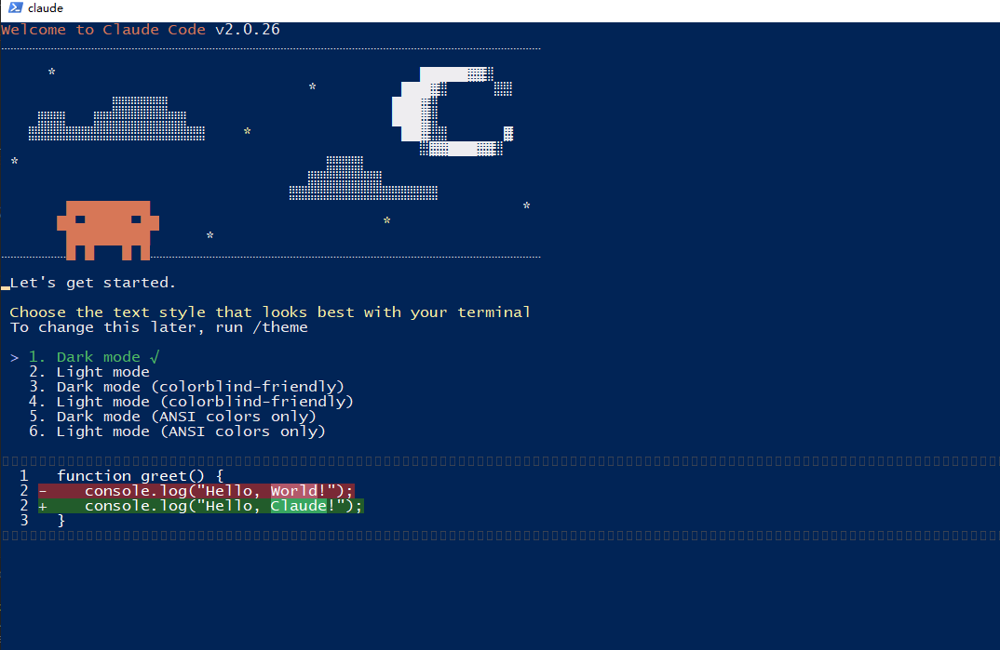

# 安装Claude
  以管理员权限，启动cmd,输入
```sh
npm install -g @anthropic-ai/claude-code
```

# 配置密钥：
在PowerShell输入
```sh
$env:ANTHROPIC_API_KEY="sk-6UpcWBvComUEcCrg5eF559AfEeE645A4B703A08f529b14Cc"
$env:ANTHROPIC_BASE_URL="https://aihubmix.com"
```

# 设置环境变量，使用AiHubaMax中转代理
```powershell
$env:HTTP_PROXY="http://127.0.0.1:7890"
$env:HTTPS_PROXY="http://127.0.0.1:7890"
```

# 选择项目文件夹，输入claude
```
claude
```


claude mcp add --transport sse copilotkit-mcp https://mcp.copilotkit.ai/sse 


