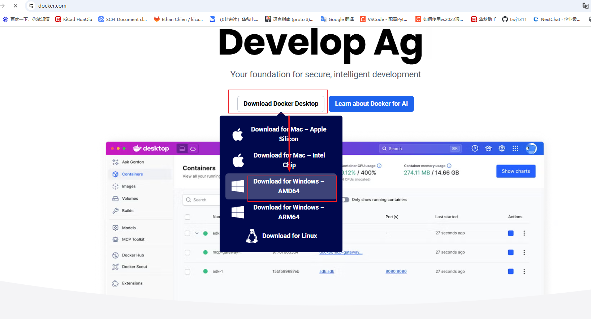
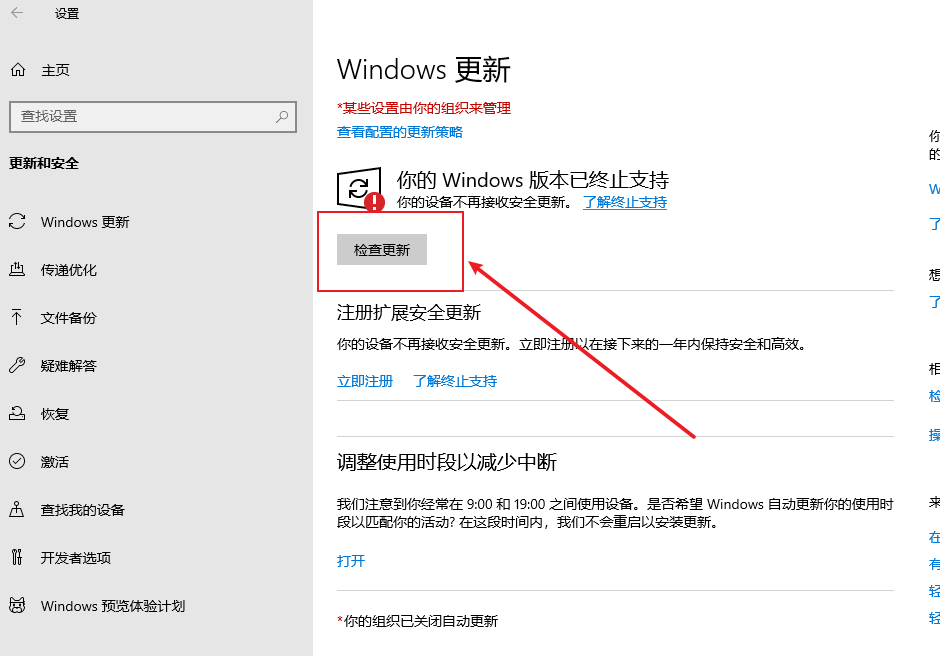
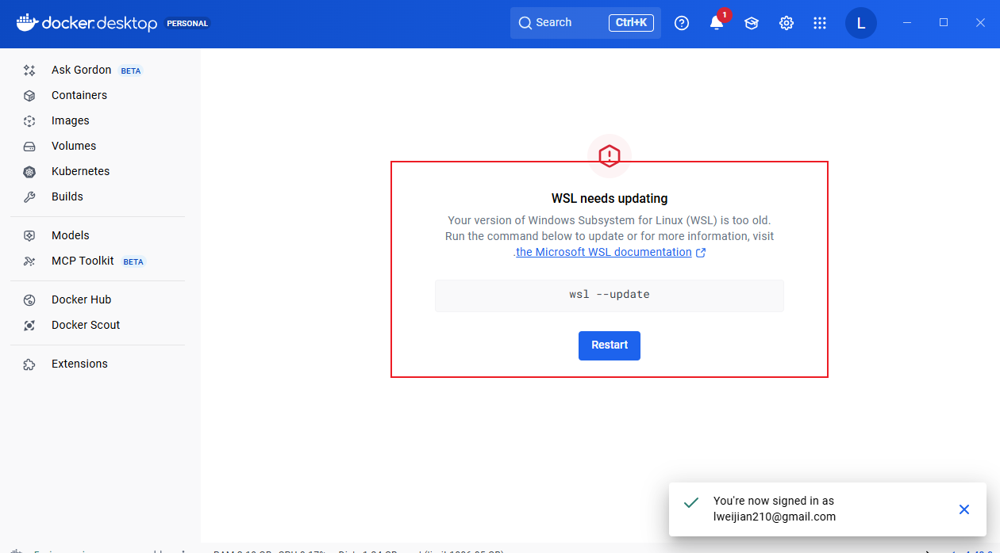
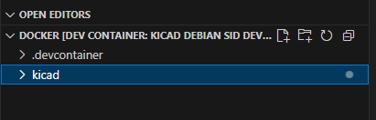
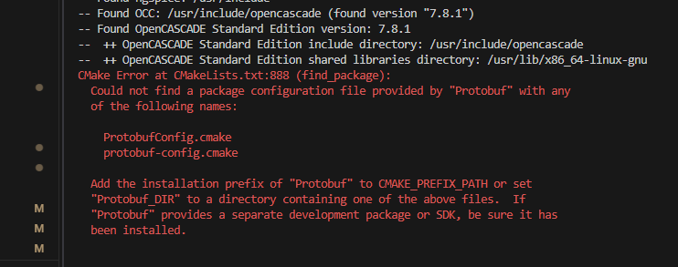
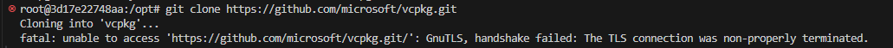
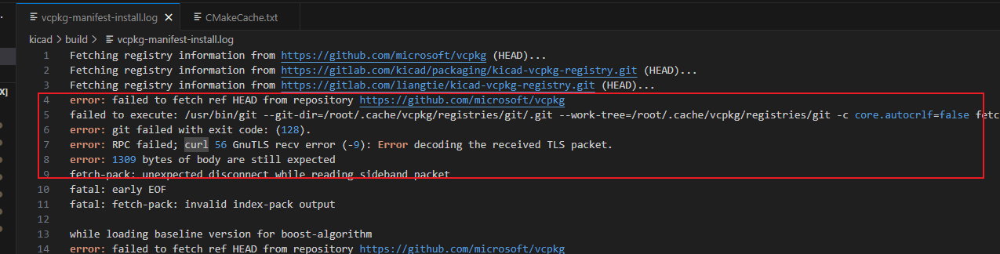
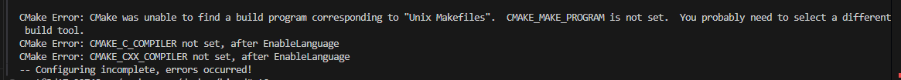

# 一、下载docker

## 1、**[官网](https://www.docker.com/)**


## 2、双击安装包
windows下安装docker，需要windwow10系统升级到**21H1**以上，低于版本的需要升级，"设置"->"更新和安全"->"检查更新"；


## 3、安装完成后，打开docker desktop后，需要注册登录；

## 4、如果docker desktop的界面提示wsl --update，需要在命令行中，输入wsl --update,更新windows子系统Linux（WSL）相关组件；


```cmd
wsl --update
```

# 二、搭建docker环境
## 1、创建根目录文件夹
```cmd
mkdir docker
```
## 2、拉取kicad仓库代码
```cmd
git clone -b feat/freerouting --depth 1 https://gitlab.com/Liuweijian123/kicad.git;
```

## 3、在根目录下新建文件夹.devcontainer
```cmd
mkdir .devcontainer
```

## 4、在.devcontainer目录下，新建文件devcontainer.json，内容如下：
```json
{
  "name": "kiCad Debian sid dev",
  "image": "registry.cn-shanghai.aliyuncs.com/kicad/kicad:dev"
}
```

## 5、用vscode打开根目录docker,安装插件Dev Containers


## 6、在vscode，打开命令面板，快捷键：Ctrl + Shift + P

## 7、输入并选择：Dev Containers: Reopen in Container
第一次打开时，需要拉取镜像，耗时较长

## 8、进入docker


### 

# 三、docker构建kicad

**注意：ubuntu下构建kicad，不要使用vcpkg**

## 1、安装依赖
首先安装：**apt-get update**,不然有些依赖包装不上
安装下面的依赖包时，最好手动逐个**apt-get install XXX-dev**，而不要一次性执行，因为手动逐个执行，可以看到哪个包装成功了，哪个失败了，
对于失败的依赖包，可以通过**关闭VPN或者切换VPN**解决，我在安装libgtk-3-dev时，挂了VPN，但是装不上，后来就把VPN关了，就可以装了；
```sh
RUN apt-get update && \
    apt-get install -y build-essential cmake libbz2-dev libcairo2-dev libglu1-mesa-dev \
    libgl1-mesa-dev libglew-dev libx11-dev libwxgtk3.2-dev libwxgtk-webview3.2-dev\
    mesa-common-dev pkg-config python3-dev python3-wxgtk4.0  \
    libboost-all-dev libglm-dev libcurl4-openssl-dev \
    libgtk-3-dev \
    libngspice0-dev \
    ngspice-dev \
    libocct-modeling-algorithms-dev \
    libocct-modeling-data-dev \
    libocct-data-exchange-dev \
    libocct-visualization-dev \
    libocct-foundation-dev \
    libocct-ocaf-dev \
    unixodbc-dev \
    zlib1g-dev \
    shared-mime-info \
    git \
    gettext \
    ninja-build \
    libgit2-dev \
    libsecret-1-dev \
    libnng-dev \
    libprotobuf-dev \
    protobuf-compiler \
    swig4.0 \
    python3-pip \
    python3-venv \
    protobuf-compiler \
    libzstd-dev
```
**注意**
相比于官方版本，发行版中，需要多安装一个**libwxgtk-webview3.2-dev**，因为发行版中用到了很多的webview功能，而官方版没有，所以官方版的dockerfile文件中，是没有<code>libwxgtk-webview3.2-dev</code>的，
如果cmake在构建时，出现类似的报错，把上面的依赖重新装一遍

如果提示找不到wxwidgets_library的错误，就是要安装libwxgtk3.2-dev 和 libwxgtk-webview3.2-dev  
[查看 官方KiCad9.0 的 dockerfile](https://gitlab.com/kicad/packaging/kicad-cli-docker/-/blob/main/Dockerfile.9.0-stable?ref_type=heads)
[查看 官方KiCad 的 debian/control 文件](https://gitlab.com/kicad/packaging/kicad-ubuntu-builder/kicad-daily-package/-/blob/dailybuild/debian/control)
## 2、构建编译kicad


```sh

# We want the built install prefix in /usr to match normal system installed software
# However to aid in docker copying only our files, we redirect the prefix in the cmake install
RUN set -ex; \
    mkdir -p build/linux; \
    cd build/linux; \
    cmake \
      -G Ninja \
      -DCMAKE_BUILD_TYPE=Release \
      -DKICAD_SCRIPTING_WXPYTHON=ON \
      -DKICAD_USE_OCC=ON \
      -DKICAD_SPICE=ON \
      -DKICAD_BUILD_I18N=ON \
      -DCMAKE_INSTALL_PREFIX=/usr \
      -DKICAD_USE_CMAKE_FINDPROTOBUF=ON \
      ../../; \
    ninja; \
    cmake --install . --prefix=/usr/installtemp/
```

## 3、安装runtime dependencies
# install runtime dependencies 
```sh
apt-get update && \
    apt-get install -y libbz2-1.0 \
    libcairo2 \
    libglu1-mesa \
    libglew2.2 \ 
    libx11-6 \
    libwxgtk3.2* \
    libpython3.11 \
    python3 \ 
    python3-wxgtk4.0 \
    python3-yaml \ 
    python3-typing-extensions \
    libcurl4 \
    libngspice0 \
    ngspice \
    libocct-modeling-algorithms-7.6 \
    libocct-modeling-data-7.6 \
    libocct-data-exchange-7.6 \
    libocct-visualization-7.6 \
    libocct-foundation-7.6 \
    libocct-ocaf-7.6 \
    unixodbc \
    zlib1g \
    shared-mime-info \
    git \
    libgit2-1.5 \
    libsecret-1-0 \
    libprotobuf32 \
    libzstd1 \
    libnng1 \
    sudo
```

# 四、编译错误 
(a)这是网络异常，切换vpn





(b)cmake报错，通过apt-get安装对应的依赖包<code>build-essential cmake ninja-build</code>
```cmake
CMake Error: CMake was unable to find a build program corresponding to "Unix Makefiles".  CMAKE_MAKE_PROGRAM is not set.  You probably need to select a different build tool.
CMake Error: CMAKE_C_COMPILER not set, after EnableLanguage
CMake Error: CMAKE_CXX_COMPILER not set, after EnableLanguage
-- Configuring incomplete, errors occurred!
```
